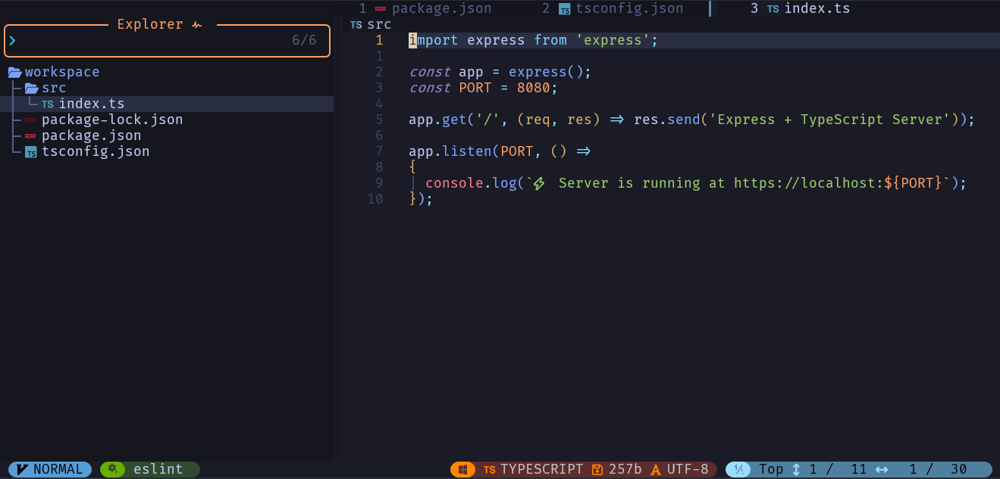

# 🧑‍💻 Codespace - Development Environment

[](https://github.com/Ealenn/codespaces/stargazers)
[](https://hub.docker.com/r/ealen/codespaces)

> A modern developer-friendly environment optimized for containers, VS Code Remote Containers, and GitHub Codespaces.

## 📦 Environment

- **Base:** [Ubuntu 24.04](https://hub.docker.com/_/ubuntu)

### 🖥 Terminal
  - [ZSH](https://www.zsh.org/) & [Oh-My-ZSH](https://github.com/ohmyzsh/ohmyzsh) Zsh is a shell designed for interactive use, although it is also a powerful scripting language.
  - [Starship](https://starship.rs/) The minimal, blazing-fast, and infinitely customizable prompt for any shell!
  - [LSD](https://github.com/Peltoche/lsd) Colorizes the ls output with color and icons.
  - [TheFuck](https://github.com/nvbn/thefuck#installation) The Fuck is a magnificent app, that corrects errors in previous console commands.
  - [JQ](https://github.com/stedolan/jq) jq is a lightweight and flexible command-line JSON processor.
  - [fd-find](https://github.com/sharkdp/fd) A simple, fast and user-friendly alternative to 'find'

### 🔧 Tools
  - [Vim](https://www.vim.org/) Vim is a highly configurable text editor built to make creating and changing any kind of text very efficient.
  - [NeoVim](https://github.com/neovim/neovim) Vim-fork focused on extensibility and usability
    - [ecosse3/nvim](https://github.com/ecosse3/nvim) A non-minimal Neovim config built to work most efficiently with Frontend Development
- But also `git`, `gpg`, `curl`, `wget`, etc.

### 🧑‍💻 Languages & Runtimes
- [Go](https://go.dev) A simple, fast, and reliable language designed for scalable and efficient software development.
- [Rust](https://www.rust-lang.org) A language empowering everyone to build reliable and efficient software.
- [NVM](https://github.com/nvm-sh/nvm) with [Node LTS](https://nodejs.dev/) installed by default. NVM is a version manager for NodeJS.
- [ZX](https://github.com/google/zx) Bash is great, but when it comes to writing scripts, people usually choose a more convenient programming language.
- [Python3](https://www.python.org) Python is a programming language that lets you work quickly and integrate systems more effectively.
  - [UV](https://github.com/astral-sh/uv) An extremely fast Python package and project manager, written in Rust.

### 🐳 Docker-in-Docker
- Full Docker CLI and Compose support inside container
- `docker.sock` ready for volume mount

## 💡 Remote Containers (VS Code)


This image is compatible with [VS Code Remote Containers](https://code.visualstudio.com/docs/remote/containers), enabling a full development experience using a containerized environment.

### Example `.devcontainer/devcontainer.json`:

```json
{
  "name": "codespaces",
  "image": "ealen/codespaces",
  "extensions": [
    "golang.go",
    "dbaeumer.vscode-eslint",
    "oouo-diogo-perdigao.docthis",
    "bungcip.better-toml",
    "redhat.vscode-yaml",
    "yzhang.markdown-all-in-one",
    "editorconfig.editorconfig",
    "gruntfuggly.todo-tree",
    "eamodio.gitlens",
    "naumovs.color-highlight",
    "vscode-icons-team.vscode-icons",
    "ms-azuretools.vscode-docker"
  ],
  "settings": {
    "workbench.iconTheme": "vscode-icons",
    "editor.fontFamily": "Consolas, 'Courier New', monospace, hack, 'Hack Nerd Font Mono'",
    "terminal.integrated.fontFamily": "Consolas, 'Hack Nerd Font Mono'",
    "terminal.integrated.fontSize": 14,
    "files.autoSave": "onFocusChange",
    "editor.tabSize": 2,
    "eslint.format.enable": true,
  },
  "mounts": [
    "source=/home/YOUR_USER/.ssh,target=/home/ubuntu/.ssh,type=bind,readonly",
    "source=/home/YOUR_USER/.gnupg,target=/home/ubuntu/.gnupg,type=bind,readonly",
    "source=/var/run/docker.sock,target=/var/run/docker.sock,type=bind"
  ]
}
```

> 💡 You must install a Nerd Font such as [Hack Nerd Font Mono](https://github.com/ryanoasis/nerd-fonts/raw/master/patched-fonts/Hack/Regular/complete/Hack%20Regular%20Nerd%20Font%20Complete%20Mono.ttf)

# 🐋 Raw Docker Usage



You can run the image without VS Code using standard Docker commands.

**Example**: Run with persistent volumes and access to Docker

```sh
docker run -it --rm \
  -v ~/.ssh:/home/ubuntu/.ssh:ro \
  -v ~/.gnupg:/home/ubuntu/.gnupg:ro \
  -v /var/run/docker.sock:/var/run/docker.sock \
  -v $(pwd):/workspace \
  -e PUID=$(id -u) \
  -e PGID=$(id -g) \
  -w /workspace \
  ealen/codespaces
```

> You can now launch nvim from inside the container, and work on your project directly from the mounted volume.

# 💻 GitHub Codespaces Support

This image is fully compatible with [GitHub Codespaces](https://docs.github.com/en/codespaces)!

To use:
1. Create a .devcontainer/devcontainer.json in your repo (as shown above).
2. Push to GitHub.
3. Open the repo in Codespaces.

That's it! You'll get a fully functional container with Docker, ZSH, Starship, Go, Rust, Node, and Python already configured.

# 📁 Example Repo

You can find a working example inside the [example/](/example/) folder.
